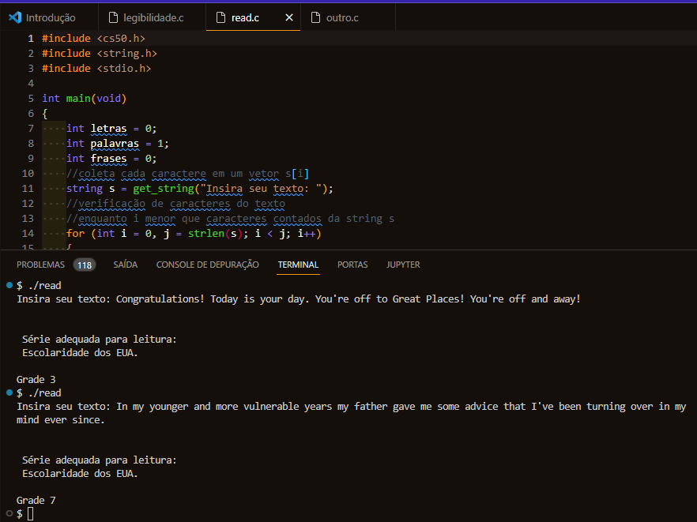

# CS50
Atividades do curso de Ciências da Computação 

## Atividade 1:

> Transformar letras em seus ASCII correspondentes.

> Usada biblioteca do CS50.

Arquivo letras-p-num.c

## Atividade 2:

> Calcular o nível de leitura necessário para ler determinado texto.

>Usada biblioteca do CS50.

Arquivo readability.c

